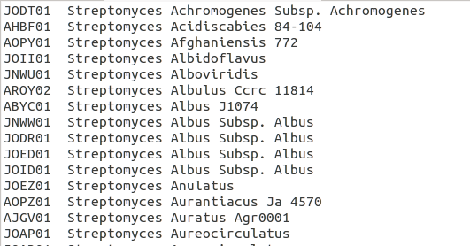
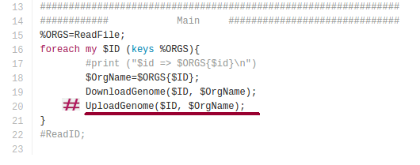
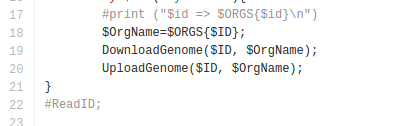
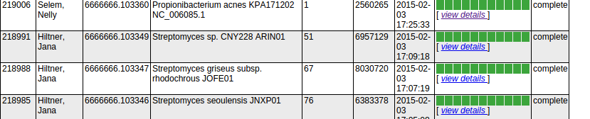
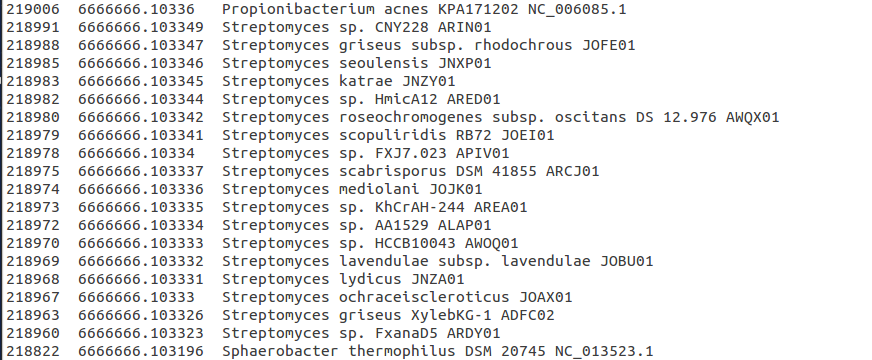

# myrast
myrast dockerfile 
This is myrast distribution on a docker file. To use myrast you need a RAST account. BEside upload and retrieve genomes that are the functionalities described here, other [myrast commands](http://blog.theseed.org/servers/usage/the-rast-batch-interface.html) can be used with this docker distribution.    

## Download myrast docker distribution   
Once you have docker installed, pull the myrast dcker distribution.  
`docker pull nselem/myrast`  

## Open myRast terminal   
`docker run -i -t -v $(pwd):/home nselem/myrast /bin/bash`  
  
## Use myRast  
Now you can use myRast:  

There are several scripts in my rast distribution, here we explain the corresponding scripts to upload, download and delete jobs to rast servers.  
> svr__submit_RAST_job    
> svr_retrieve_RAST_job  
> svr_delete_RAST_job   

### To upload fasta/genbank we use thse script `svr_submit_RAST_job `    
`svr_submit_RAST_job -user <user> -passwd <pass> -fasta <file> -domain Bacteria -bioname "Organism name" -genetic_code 11 -gene_caller rast`    

This script has several parameters:  
  
| Parameter  | Description  |   
|---|---|    
|--user username   |  RAST login for the submitting user  |  
|--passwd password  | RAST password for the submitting user    |  
|--genbank filename  |   If submitting a genbank file, the file of input data.  |  
|--fasta filename  |  	If submitting a FASTA file of contigs, the file of input data.  |  
|--domain  |Bacteria or	     |  
|--domain | Archaea	Domain of the submitted genome.   |  
|--taxon_id taxonomy-id  | The NCBI taxonomy id of the submitted genome    |  
|--bioname "genus species str."   |  Biological name of the submitted genome   |  
|--genetic_code ( 11 | 4 )	 | Genetic code for the submitted genome, either 11 or 4.    |  
|--gene_caller | Gene caller to use (FigFam-base RAST gene caller or straight Glimmer-3)    |  
|--reannotate_only	 |  Preserve the original gene calls and use RAST   |  

  
Note On -bioname it is important that the first letter is capital and all the others lowercase, as on scientific names.  
 
 To upload genomes in batch to RAST you can also use the following bash script. You will need a file tab separated where the first column contains the name of the genome files, and the second column the scientific name of the organism. Name this file IdsFile and place yourself where the genome files and th ids files is located. Finally, please substitute your username and password in the corresponding places and copy and paste this script in the terminal inside the myrast docker.  
`cat IdsFile | while read line; do id=$(echo $line|cut -f1); name=$(echo $line|cut -f2); echo  svr_submit_RAST_job -user <usr> -passwd <pass> -genbank $id -domain Bacteria -bioname "${name}" -genetic_code 11 -gene_caller rast; svr_submit_RAST_job -user <usr> -passwd <pass> -genbank $id -domain Bacteria -bioname "$name" -genetic_code 11 -gene_caller rast; done   `   

###  To retrieve RAST files `svr_retrieve_RAST_job`.   
  
`svr_retrieve_RAST_job <user> <password> <jobId> table_txt > $ID.txt`  

if you have a list of files, you can process it with bash. For example to download a list of RAST files, store the RAST Id numbers on a file, (Rast_ID on this example) and use a while from bash to retrieve them:  
  
On this case the variable "line" will contain a RAST Id number, and each amino acid file from a RAST Id will be downloaded and stored on "$line.faa"    
`cut -f1 Rast_ID | while read line; do  svr_retrieve_RAST_job <user> <password> $line amino_acid > $line.faa ; done`

You can change the format table_txt for whatever format you need.  

| Attribute               | Description                                               |  
| :---------------------- | :-------------------------------------------------------- |  
| genbank                 | GenBank (with SEED function conventions and enhancements) |  
| genbank_stripped        | GenBank with EC-numbers stripped from functions           |  
| embl                    | EMBL (with SEED function conventions and enhancements)    |  
| embl_stripped           | EMBL with EC-numbers stripped from functions              |  
| gff3                    | GFF3                                                      |  
| gff3_stripped           | GFF3 with EC-numbers stripped from functions              |  
| gtf                     | GTF                                                       |  
| gtf_stripped            | GTF with EC-numbers stripped from functions               |  
| rast_tarball            | gzipped tar archive of the RAST genome directory          |  
| nucleic_acid            | DNA for genes                                             |   
| amino_acid              | Protein translations for genes                            |  
| table_txt               | Gene data in tab-separated format                         |  
| table_xls               | Gene data in EXCEL format                                 |   

###  To delete RAST files `svr_delete_RAST_job`.   
 svr_delete_RAST_job username password jobnumber`  

## Extra features included in myrast docker.  
1. Download genomes from NCBI.  
2. Upload genomes to RAST.  
3. Download genomes to RAST.  

## 1 Download genomes from NCBI  
### Download NCBI genomes using a perl script included in this myrast docker.  
**Input Files:**  
Id_NCBI file (File with the genome ids from NCBI you wish to upload to RAST)  
1.NCBI_and_RAST script from GitHub  
`perl 1.NCBI_and_RAST Id_NCBI  `
NOTE: To run the 1.NCBI_and_RAST script, it will be done inside the docker, in the myrast option

**1.1 Id_NCBI file**
Prepare the file Id_NCBI. It should be a text file with two columns. The first column filled with NCBI Ids, the second column should contain the organism's genus with the species name. The two columns must be tab separated. Accepted IDs: You can only use ids from the NCBI databases protein, nucleotide and genome.

NOTE: To see the status of the job, type: $svr_status_of_RAST_job user password jobID
If you want to review other options, could visit http://blog.theseed.org/servers/usage/the-rast-batch-interface.html

Figure 1- File with NCBI Id’s, genus and species names.

You can look for the NCBI ids from the following links:   
[Assembly NCBI](http://www.ncbi.nlm.nih.gov/Traces/wgs/?page=1&term=actinomyces&project=WGS&update_date=any&create_date=any&order=prefix&dir=a&have_scaffolds=on&do_not_have_scaffolds=on&have_annot_contigs=on&have_annot_scaffolds=on)  
[Genoma NCBI](http://www.ncbi.nlm.nih.gov/genome/browse/)  
Note. Please check that your organism name is correctly written. And that is only the First letter of the genus must be capital. Names like CORYNEBACTERIUM ACCOLENS ATCC 49725 won't be accepted, you must write  Corynebacterium accolens atcc 49725 instead. You can use in excel or libre office the option Format->Change Capitals (feature not present in google drive).
  
  
To download genomes without using RAST please comment line 20 adding a character # at the beginning of line, Figure 2. Save your changes.   
  
  
Figure 3. Modify line 20 if you are not planning to use RAST, and this is if you only want to download genomes from NCBI.

Finally, run the script:     
`perl 1.NCBI_and_RAST Id_NCBI`  

### Download genomes using [ncbi-genome-download](https://github.com/kblin/ncbi-genome-download) github repo from kblin. 

To download some specific bacteria we have used  
`ncbi-genome-download --genus Clavibacter bacteria --parallel 4 --assembly-level complete --format fasta_ --dry-run >IDS`
`ncbi-genome-download --genus Clavibacter bacteria --parallel 4 --assembly-level complete --format fasta_ --dry-run >IDS`

`ncbi-genome-download --dry-run bacteria`  

## 2. RAST upload genomes  
**Input files** 
Id_NCBI file (File with the genome ids from NCBI you wish to upload to RAST)
1.NCBI_and_RAST script from GitHub  
`1.NCBI_and_RAST Id_NCBI file user pass`    

**Id_NCBI file** 
Follow the instructions in the page above.

## 3. RAST retrieve genomes   
**Input Files:**
RAST_id  file with your RAST ids
2.Batch_RetrievesFiles.pl script from GitHub
`2.Batch_RetrieveFiles.pl RAST_id`

**3.1. Id_RAST file**
From your jobs overview personal website, copy the job, the id and the  organism name columns in a text tab separated file. First, from the RAST web site save the jobId, the genome Id and the organism name of your interest.  
  
  
Figure 5. Get your job ids, genome Ids and organism names from RAST website.  
  
 After that use the information to construct a tab separated file.  
  
Figure 6. Create a file with your jobs id’s.
  
Create a tab separated file  
1.Copy the table in an excel or google sheet file.  
2.Delete the columns you don’t need.  
3.Copy the columns you need into a text editor like vi, nano, gedit, etc. (remember word is not a text editor).  
4.Save the file.  
  
